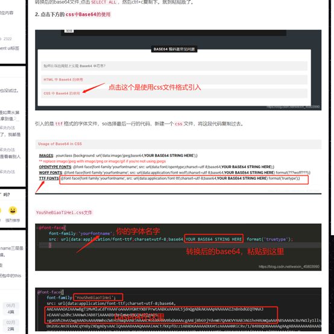
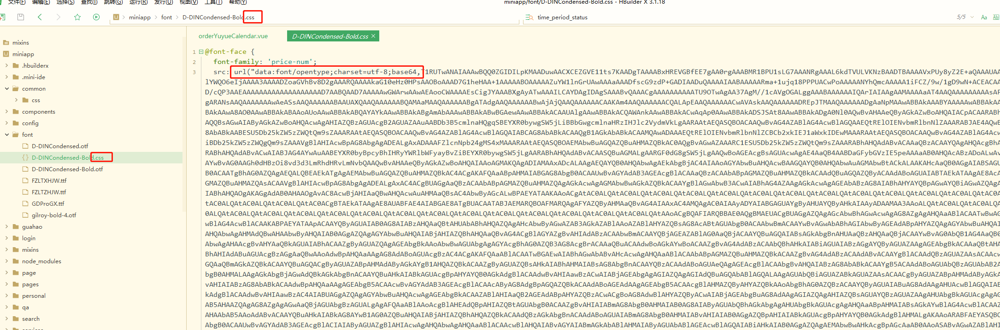

## 项目的坑
### 小程序体验版打开调试模式才能加载数据，不然加载不了数据
    在微信开发者工具里面数据是可以正常加载的
1.  清理一下缓存, 数据是否还能继续正常加载
2.  打开开发者工具右上角详情, 检查“不校验合法域名、web-view（业务域名）、TLS 版本以及 HTTPS 证书”是否被勾选上。如果已经被勾选上，就把勾选去掉，然后编译，查看在微信开发者工具中数据是否还能正常加载过来，如果不能正常加载出来，看一下控制台的报错，看是不是没有在后台把域名加入到合法域名里面
   
总结: 调试模式下微信不会去检查api接口域名的合法性，而微信开发者工具在勾选“不校验合法域名、web-view（业务域名）、TLS 版本以及 HTTPS 证书”后也不会对域名的合法性做检查。有时候要考虑一下, 有的接口开了调试返回数据会快一些, 有的不开调试返回数据很慢, 以至于一些操作失效。比如我神策埋点的时候，从某个接口取一个值，那个值在页面的都渲染出来了，但是还是取不到那个值，开调试可以

### 加载本地图标文件不成功
1. 本地字体文件小于40kb的时候可以直接引入使用, uni-app会自动转换为base64格式;

    ```css
        @font-size {
            font-family: 'YouSheBiaoTiHei';
            src: url('~@/static/font/YouSheBiaoTiHei.ttf');    
        }
        /* 使用 */
        .test {
            font-family: YouSheBiaoTiHei;
        }

    ```
2. 本地字体大于40kb, 要先将字体文件转换为base64, 再引入使用。[在线转换地址](https://www.giftofspeed.com/base64-encoder/)

    
    新建一个css文件,把base64字符串粘贴进去
    字体的格式一定要选对，otf是data：font/opentype
    

3. 如果本地引入的字体太大最好是把字体文件放到服务器端, 在线引入(公司wechat-vue仓库有个文件夹专门放静态资源)
   
   ```css
        @font-face {
            font-family: 'lala',
            src: url('https://wximg.91160.com/wechat/img/miniProgram/default/icon-tag-type2.png')
        }
   ```

### 神策埋点
 [文档](https://manual.sensorsdata.cn/sa/latest/tech_sdk_client_mp_wechat-27724236.html)
1. 按照文档一步步埋点即可, 不要忽略用户登录那个步骤, 因为默认是使用UUID
 (每次登录成功都不一样), 如果没有传user_id的话, 就无法记录到到用户的行为
2. 服务端埋点的时候, 前端这边要给服务端传预置属性, 以及一些必须的自定义属性, 比如渠道id, 来源类型等
3. 公共属性也要记得, 设置了公共属性的话, 后续的上报都会带上公共属性


### uni-app嵌套使用v-for

```js
<div v-for="(item,index) in jtem.list" :key="index">
    <div>
        <div>
            <div v-for="(items, i) in time_array" :key="i">
                <span>{{items.time_period}}</span>
            </div>
        </div>
    </div>
</div>
// 如果第二个 v-for继续使用 item, 跟上一个同名, 会导致取不到值
```    
    
