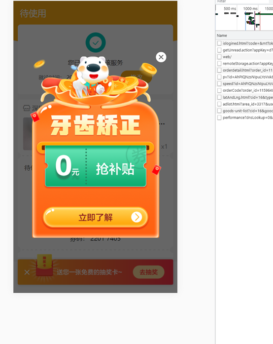
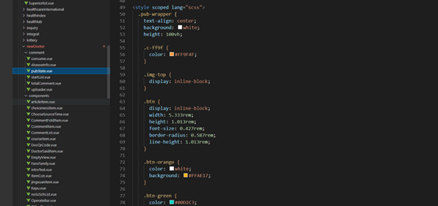
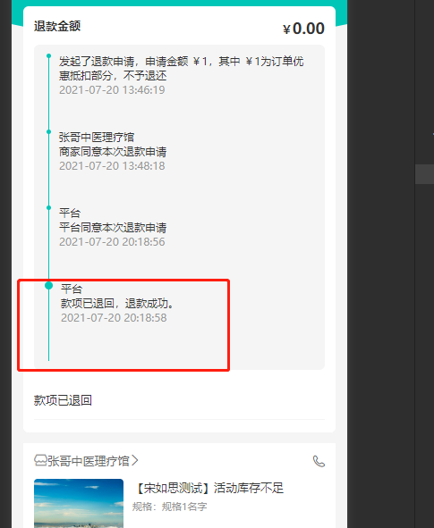

# 小程序第二期剩下问题    -- 7/27

1. 商品详情页要显示距离，问后端可不可以根据前端传的经纬度返回，不能根据上一个页面传入，如果单单分享的是商品详情页的话，不能从上一个页面拿到参数
2. 确认广告图片这期要不要加上(代码里面有这个接口)
   
3. 积分留到下一期再做
4. 确认支付页面，点击返回应该提醒他是否放弃支付，小程序不支持返回监听，问一下永胜有没有方法实现
5. 我项目中也有这个组件，到时候医生那边也有，跟永胜商量一下抽出来
   
6. 添加就诊人还有一个管理功能，看要不要干掉右上角的原生按钮，还有直接跟新增就诊人放同一行就好
7. 加载页面的时候，如果还没有数据不要先显示undefined
8. 修改昵称接口
9. 选择就诊切换账号的时候成功了，不知道是不是跟之前删除数据有关
10. 那个退款或者售后详情，那个流程接口可能的叫后端加字段，要不判断不了它的流程是否结束(退款详情跟售后详情都要改)
    接口名： https://wap.91160.com/health/getRefundLogs.html
   
11. 还有ui的问题


# 7/28
1. 接口还是没有加上距离的字段https://wechatgate.91160.com/shop_goods/v1/goods_detail
2. 确认广告图片这期要不要加上(代码里面有这个接口)
   
3. 积分留到下一期再做
4. 已解决，使用自定义按钮覆盖原生的返回按钮
5. 我项目中也有这个组件，到时候医生那边也有，跟永胜商量一下抽出来
   
6. 添加就诊人还有一个管理功能，看要不要干掉右上角的原生按钮，还有直接跟新增就诊人放同一行就好
7. 加载页面的时候，如果还没有数据不要先显示undefined
8. 修改昵称接口
9. 选择就诊切换账号的时候成功了，不知道是不是跟之前删除数据有关
10. 那个退款或者售后详情，那个流程接口可能的叫后端加字段，要不判断不了它的流程是否结束(退款详情跟售后详情都要改)
    接口名： https://wap.91160.com/health/getRefundLogs.html
   
11. 还有ui的问题
12. 预览还是跑不起来，明天上传代码让永胜看一下，项目结构没有优化好
13. 小程序域名大部分换成了微信域名，哪些接口发生重定向要改为微信域名才行，要加cid
14. 申请售后流程图
15. 收藏按钮
16. 之前那个来回横跳，无效的
17. 加上scoped


# 7/29
1. 接口还是没有加上距离的字段https://wechatgate.91160.com/shop_goods/v1/goods_detail
2. 确认广告图片这期要不要加上(代码里面有这个接口)
3. 我项目中也有这个组件，到时候医生那边也有，跟永胜商量一下抽出来
4. 添加就诊人还有一个管理功能，看要不要干掉右上角的原生按钮，还有直接跟新增就诊人放同一行就好
5. 加载页面的时候，如果还没有数据不要先显示undefined
6. 修改昵称接口
7. 还有ui的问题
8. 预览还是跑不起来，明天上传代码让永胜看一下，项目结构没有优化好
9. 小程序域名大部分换成了微信域名，哪些接口发生重定向要改为微信域名才行，要加cid
10. 加上scoped
11. 使用storage进行缓存的话，自己用到的就放到一个大的对象里面，后面页方便管理
12. 顶部标题改成跟挂号主页的一样
13. 所有wap域名，换成weixin域名并加上cid


# 7/30
1. 接口还是没有加上距离的字段https://wechatgate.91160.com/shop_goods/v1/goods_detail
2. 确认广告图片这期要不要加上(代码里面有这个接口)
3. 我项目中也有这个组件，到时候医生那边也有，跟永胜商量一下抽出来
4. 添加就诊人还有一个管理功能，看要不要干掉右上角的原生按钮，还有直接跟新增就诊人放同一行就好
5. 加载页面的时候，如果还没有数据不要先显示undefined
6. 小程序域名大部分换成了微信域名，哪些接口发生重定向要改为微信域名才行，要加cid
7. 加上scoped
8. 使用storage进行缓存的话，自己用到的就放到一个大的对象里面，后面页方便管理
9. 顶部标题改成跟挂号主页的一样
10. 优惠券改了接口，逻辑也变了
11. 不要写重复代码，比如我的cid都是直接重复写，永胜时封装在一个地方，也好修改，DRY原则
12. 有一个health.js 和healthProduct.js重复了
13. cid永胜封装好了，还有apihost里面，wap改为weixin
14. 记得把永胜得合入我这

# 8/2
1. 确认广告图片这期要不要加上(代码里面有这个接口)
2. 我项目中也有这个组件，到时候医生那边也有，跟永胜商量一下抽出来
3. 添加就诊人还有一个管理功能，看要不要干掉右上角的原生按钮，还有直接跟新增就诊人放同一行就好,永胜那边还没开发，留到下一期
4. 加载页面的时候，如果还没有数据不要先显示undefined
5. 小程序域名大部分换成了微信域名，哪些接口发生重定向要改为微信域名才行，要加cid
6. 加上scoped
7. 使用storage进行缓存的话，自己用到的就放到一个大的对象里面，后面页方便管理
8. 顶部标题改成跟挂号主页的一样
9.  有一个health.js 和healthProduct.js重复了
10. cid永胜封装好了，还有apihost里面，wap改为weixin
11. 跟永胜商量产品详情页怎么从登录页自动跳到下一个页面，确认订单打开登录页面之前，加了一个缓存，如果回来，在进入详情页的时候判断缓存存不存在，存在就直接跳到确认订单页，在确认订单页面清楚缓存，这样返回就不会又跳转确认订单页

# 8/4
1. 确认广告图片这期要不要加上(代码里面有这个接口)
2. 我项目中也有这个组件，到时候医生那边也有，跟永胜商量一下抽出来
3. 添加就诊人还有一个管理功能，看要不要干掉右上角的原生按钮，还有直接跟新增就诊人放同一行就好,永胜那边还没开发，留到下一期
4. 加载页面的时候，如果还没有数据不要先显示undefined, 有的页面还没改造好
5. 小程序域名大部分换成了微信域名，哪些接口发生重定向要改为微信域名才行，要加cid
6. 加上scoped
7. 使用storage进行缓存的话，自己用到的就放到一个大的对象里面，后面页方便管理
8. 顶部标题改成跟挂号主页的一样
9.  cid永胜封装好了，还有apihost里面，wap改为weixin
10. 确认订单页面，查看优惠券，要做列表数据缓存，使用vuex，要不每次切换tab都需要请求一次接口，这样体验不好。
11. 把代码中的console.log去掉了

# 8/6
1. 确认广告图片这期要不要加上(代码里面有这个接口)
2. 我项目中也有这个组件，到时候医生那边也有，跟永胜商量一下抽出来
3. 添加就诊人还有一个管理功能，看要不要干掉右上角的原生按钮，还有直接跟新增就诊人放同一行就好,永胜那边还没开发，留到下一期
4. 加上scoped
5. 使用storage进行缓存的话，自己用到的就放到一个大的对象里面，后面页方便管理
6. 顶部标题改成跟挂号主页的一样
7.  cid永胜封装好了，还有apihost里面，wap改为weixin
8.  页面底部吐槽框被确定按钮所遮挡，看后期要不要改
9.  如果把所有家庭成员删除了，在订单详情选择就诊人的时候，无法进入页面


# 8/9
1. 顶部标题改成跟挂号主页的一样,如果不是自定义头部栏的话，改不了
2. 下期加上广告图片那个功能，在订单列表可以看到辉弹出广告，好像订单详情也会
3. 使用storage进行缓存的话，自己用到的就放到一个大的对象里面，后面页方便管理
4. 页面底部吐槽框被确定按钮所遮挡，看后期要不要改
5. 如果把所有家庭成员删除了，在订单详情选择就诊人的时候，无法进入页面

# 8/17
1. 药品一期一些接口改动了，他们还没上线，对我们小程序某些商品的展示有影响，到时候可以问明戊拿一下需求文档，看哪一些改动了

# 8/18
1. 盛哥把weixin域名改为了weapp的
2. 上线之前记得把永胜那边原来跳转h5的地方改为跳转为原生的
3. ui整改，顺便问一下永胜上线流程，上线之前记得拉最新的master再合入

# 9/7
1. 积分没加
2. 详情广告没加
3. 体检tab跳原生还没改
4. 订单详情里面底部的广告跳的是h5的积分抽奖，那里面操作流程又变成了h5的了


## 9/13
1. 新增套餐自动生成图文详情功能
2. 体检的原生详情跳转还没上, 而且涉及到了很多页面, 智能页面的也有, 主页中机构也有, 搜索也有, 机构主页也有
   订单列表体检订单还是跳的h5的订单详情, 体检的立即预约也是, 注意订单列表跟订单详情有一个发票的功能

## 9/14
   这个需求还没确定啥时候上线，暂时还没改，到时候新建一个分支
1. 获取cookies存起来，后续所有weixin域名的请求都要加上cookies。可以减少请求次数，不知道啥时候上线，先不改，lin_cookies
   ``` js 
   // 这个接口可以拿到cookies
   'https://wap.91160.com/user/islogined.html?user_key=715375c73878fccc7be5330ba6be9be6hcBUFsoh20210915105643&cid=100012084'


   uni.request({
        url: `https://wap.91160.com/user/islogined.html?user_key=${getUserKey()}&cid=${cid}&token=${getToken()}`,
        data: params,
        method: 'POST',
        header: {
            "Content-type": 'FORM' 
        },
        success: (res) => {
            console.log(res,'resres')   // 
            // resolve(res.data)
        }			
    })
   ```


## 优化代码，把图片文件放到wechat-vue
1. 删除没用的文件
2. 一些非必要页面改为跳转h5


## 2021/11/8
1. 埋点是所有涉及到那个功能的地方的都得埋，如果没有fun_id跟cur_id就不填 
2. 前端埋点不用传预置属性，自动传过去了，后端埋点，前端需要在埋点的地方根据需要传预置属性
3. 服务端那边埋点在接口多传一个  _scdata ，这个参数是json格式的，传所有预置属性         _scdata: JSON.stringify(getApp().sensors.getPresetProperties())
   而且要把需要传的参数都放到 _scdata这个对象里面
4. 商品列表频道页 是在右上角体检进去的 H5页面
5. 干掉console.log()
6. ip id是后台返回，让盛哥返回 LBS城市ID 是定位返回
7. 给盛哥传值，code,经纬度, cid
8. 友盟埋点新建需求


## 11/16
1. lin_youmeng分支还没合到master(已合入)
2. 自己切一个仓库出来乱搞一下git命令

## 11/22
1. scdata 加上from_type, wap那边可能也要进行处理要不监听不了用户后续操作
2. 体检预约日期还没改, 可以使用uview 2.0框架的组件
3. 有时候看一下uview的源码，有一些组件有很好的实现方法